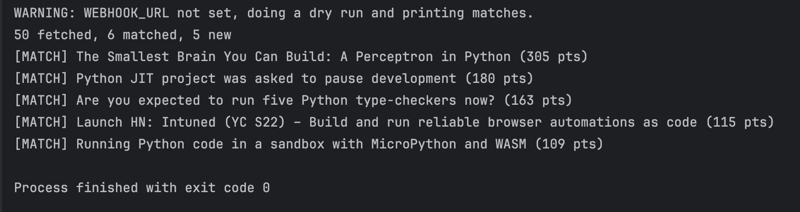

# HN Watcher

A small Python script that watches Hacker News for topics you care about and pings you on Discord or Slack when something good shows up. Think of it as a self-hosted Zapier zap: trigger, filter, action, all in about 100 lines of code, running on a schedule for free.

## Demo

A dry run (no webhook configured), printing the matches to the console instead of sending them:



Here the script fetched 50 recent stories, 6 passed the upvote filter, and 5 were new since the last run.

## How it works

The script runs a four step pipeline every time it executes:

1. **Fetch.** Calls the free Hacker News Algolia API and pulls the 50 most recent stories for each keyword in the config.
2. **Filter.** Keeps only stories that meet the minimum upvote count, so you only hear about things the community found interesting.
3. **Dedupe.** Checks `seen_stories.json`, a local file remembering every story you have already been alerted about, and skips those. Nothing is ever sent twice.
4. **Notify.** Posts each new match to your Discord or Slack channel through a webhook, with the title, points, article link, and discussion link.

Run it once and it checks once. Schedule it with cron and it becomes an always-on alert system.

## Setup

```bash
pip install -r requirements.txt
```

Create a webhook. In Discord: Server Settings, Integrations, Webhooks, New Webhook, pick a channel, Copy URL. Then:

```bash
export WEBHOOK_URL="https://discord.com/api/webhooks/..."
```

Without `WEBHOOK_URL` set, the script does a safe dry run and prints matches to the console, like the demo above.

## Configuration

Everything lives in the `CONFIG` block at the top of `hn_watcher.py`:

| Key | What it does | Default |
|---|---|---|
| `keywords` | Topics to search for | python, automation, open source |
| `min_points` | Minimum upvotes to qualify | 50 |
| `max_alerts_per_run` | Cap on alerts per execution | 5 |

Tip: set `min_points` to 1 while testing so matches show up immediately.

## Run it

```bash
python hn_watcher.py
```

To delete the memory and start fresh, remove `seen_stories.json`.

## Schedule it

Mac/Linux, every 30 minutes via cron:

```
*/30 * * * * /usr/bin/python3 /path/to/hn_watcher.py
```

Windows: use Task Scheduler pointing at `python.exe` with the script path as the argument.

## Notes

Never commit your webhook URL. Keep it as an environment variable. The `.gitignore` already excludes `seen_stories.json` and `.env`.